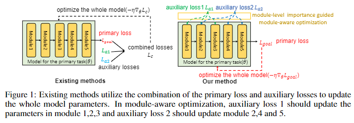

# Module-Aware Optimization for Auxiliary Learning
by Hong Chen, Xin Wang, Yue Liu, Yuwei Zhou, Chaoyu Guan and Wenwu Zhu.

## Introduction
This work can be used when you want to optimize a model for the target task with the help of several auxiliary losses. It can automatically find how much each auxiliary loss should contribute to each part of the whole model, preventing the potential module-wise conflicts. Some of the auxilearn codes are modified from the [AuxLearn Repo](https://github.com/AvivNavon/AuxiLearn), we thank them for offering the code. 

## Dataset
The provided code is for reproducing the MovieLens experiment in the paper. Create a folder named data in the repo using:
```
mkdir data
```
Then download the preprocessed dataset MovieLens-1M from the [link](https://cloud.tsinghua.edu.cn/f/0aa8e2024c4647248279/?dl=1) and unzip it in the data folder.
## Run the experiment
You can run the script to reproduce the MovieLens experiments. The argument "exp_name" is the name for the experiment. 
```
sh train.sh
```
Additionally, if you want to run some of the baselines or tune hyperparameters, change the params.json in the config folder. 
### Explanation for key configs
    + ['main']['lr']: learning rate for the lower optimization
    + ['hyper']['lr]: learning rate for the upper optimization
    + use_aux: 1 for methods using bi-level optimization, 0 for methods that do not use bi-level optimization
    + interval: iteration between two upper optimization
    + mode: 'modular(MAOAL)', 'GCS', 'common'(SLL/Equal, change ['main']['aux_weight] to 0.0 for SLL, 1.0 for Equal), 'aux'(AuxL)

## Lower and Upper Optimization
    + lower: The importance parameterized gradient is implemented in the hypermodel class in the train_regularizer.py.
    + upper: In line 274-line 315, the upper optimization is conducted. gauxlearn package includes the algorithm for upper gradient calculation.


You may also find the papers in the citation useful.

## Citation
```
@inproceedings{chen2022auxiliary,
title = {Auxiliary Learning with Joint Task and Data Scheduling},
author = {Chen, Hong and Wang Xin, and Guan, Chaoyu and Liu, Yue and Zhu Wenwu},
booktitle = {International Conference on Machine Learning},
pages = {3634--3647},
year = {2022},
organization = {PMLR}
}
```
```
@inproceedings{
chen2022moduleaware,
title={Module-Aware Optimization for Auxiliary Learning},
author={Hong Chen and Xin Wang and Yue Liu and Yuwei Zhou and Chaoyu Guan and Wenwu Zhu},
booktitle={Thirty-Sixth Conference on Neural Information Processing Systems},
year={2022},
url={https://openreview.net/forum?id=x-i37an3uym}
}
```


